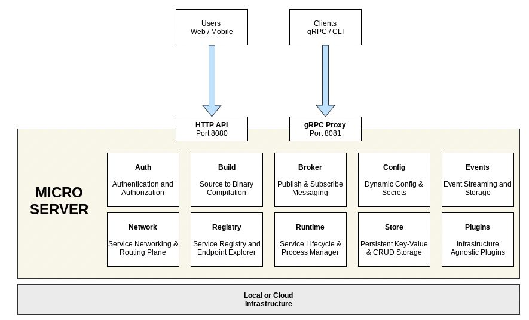
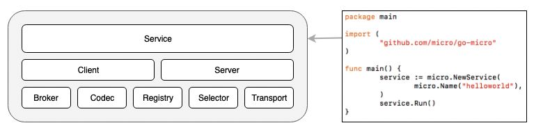
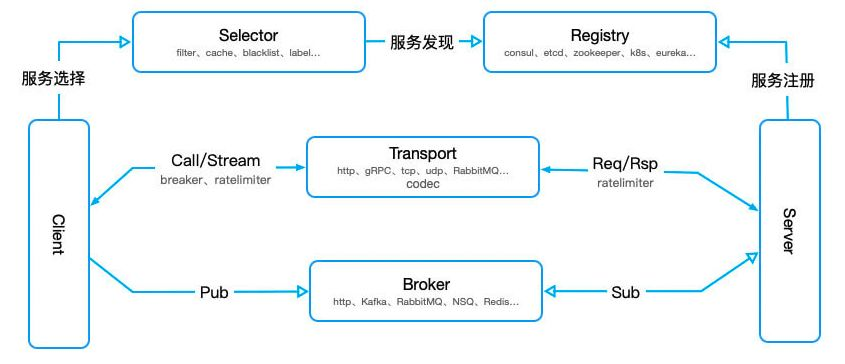
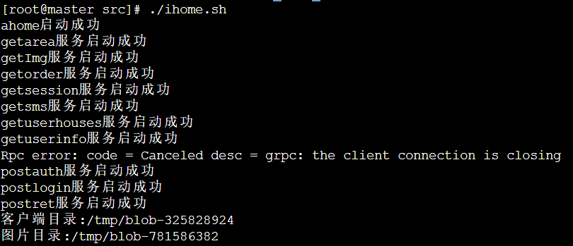

# 爱家租房

## 基本介绍

爱家租房是用微服务框架go-micro 3.0 和Gin框架搭建的项目

ahome 是用 gin 搭建的 http 服务

services 目录里包含各个微服务项目

common 目录包含公共的组件，其中 ihome\common\model\config.go 是数据库和域名相关的配置文件

go_fdfs_client 是分布式文件系统FastDFS 的 Go 客户端实现。安装 FastDFS 查看这篇文章：https://blog.csdn.net/weixin_45735355/article/details/120363282

shell 脚本 ihome.sh 是启动各个服务的脚本，由于在运行 `micro run .` 编译过程中， ahome 文件夹内静态文件不会自动复制到临时目录，所以用shell脚本来复制。ihome\services\getImg 服务里的 comic.ttf 字体格式在编译不会自动复制到临时目录，所以得人工复制，也是用 shell 脚本来实现

## go-micro特性

Go Micro是一个流行的微服务架构，是一个插件化的基础框架，基于此可以构建微服务，Micro的设计哲学是可插拔的插件化架构。Go Micro 简单轻巧、易于上手、功能强大、扩展方便，是基于 Go 语言进行微服务架构时非常值得推荐的一个框架。

Go Micro有以下重要特性：

- 服务发现：自动服务注册和名称解析。服务发现是微服务开发的核心。
- 负载均衡：基于服务发现构建的客户端负载均衡。一旦我们获得了服务的任意数量实例的地址，我们现在需要一种方法来决定要路由到哪个节点。
- 消息编码：基于内容类型的动态消息编码。这包括默认的protobuf和json。
- 请求/响应：基于RPC的请求/响应，支持双向流。
- Async Messaging：PubSub是异步通信和事件驱动架构的重要设计思想。事件通知是微服务开发的核心模式。
- 可插拔接口：Go Micro为每个分布式系统抽象使用Go接口，因此，这些接口是可插拔的，并允许Go Micro与运行时无关，可以插入任何基础技术



## go-micro通信流程

通信的角色一共4个：server,client,register和broker，他们的各种的作用在于：

1. Server监听客户端的调用，和Broker推送过来的信息进行处理。并且Server端需要向Register注册自己的存在或消亡，这样Client才能知道自己的状态；
2. Register服务的注册的发现，Client端从Register中得到Server的信息，然后每次调用都根据算法选择一个的Server进行通信，当然通信是要经过编码/解码，选择传输协议等一系列过程；
3. 如果有需要通知所有的Server端可以使用Broker进行信息的推送，Broker 通过队列进行信息的接收和发布；



Go Micro 框架的基础架构如上图所示，由 8 个核心接口组成，每个接口都有默认实现。Go micro 由以下接口列表组成:

- 最顶层的 Service 接口是构建服务的主要组件，它把底层的各个包需要实现的接口，做了一次封装，包含了一系列用于初始化 Service 和 Client 的方法，使我们可以很简单的创建一个 RPC 服务；
- server - 用于处理请求和通知。服务器是编写服务的构建基块，内置服务器是 RPC 系统
- client - 用于高级别请求/响应和通知；
- broker - 异步消息传递，其实就是一个消息队列系统；
- config - 用于动态配置的。配置是一个接口, 用于从任意数量的源进行动态配置加载，其实就是一个配置进程/中心；
- codec - 用于消息编码的（序列化和反序列化）。编解码器用于编码和解码消息, 然后再通过导线传输消息. 数据可能是 json, protobuf, beson, msgpack 等。
- registry - 服务发现的注册表。注册表提供一种服务发现机制, 用于将名称解析为地址. 它可以由 consul, etcd zookeeper, dns, gossip 等支持. 服务应在启动时使用注册表进行注册, 并在关闭时取消注册。
- selector - 用于负载平衡。选择器是一个负载平衡抽象, 它建立在注册表上。 户在发出请求时利用选择器. 客户端将使用选择器而不是注册表, 因为它提供了内置的负载平衡机制.
- store - 用于数据存储。存储是一个简单的键值存储接口, 用于抽象掉轻量级数据存储，仅用于保存简单的状态信息，比如用户的验证状态。
- transport - 用于同步通信。传输是服务之间同步请求/响应通信的接口. 它类似于 golang 网络包, 但提供了一个更高级别的抽象, 允许我们切换通信机制



## gRPC通信

gRPC 是一个高性能、通用的开源RPC框架，其由 Google 主要面向移动应用开发并基于HTTP/2 协议标准而设计，基于 ProtoBuf(Protocol Buffers) 序列化协议开发，且支持众多开发语言。

关于gRPC介绍：https://zhuanlan.zhihu.com/p/27595419


## 安装

```sh
# Download latest proto releaes
# https://github.com/protocolbuffers/protobuf/releases
$ go get github.com/golang/protobuf/protoc-gen-go
$ go get github.com/micro/micro/v3/cmd/protoc-gen-micro
$ go get github.com/micro/micro/v3
```

## 运行服务

启动micro相关的服务进程

```sh
$ micro server
```

接下来需要登录账号，做身份验证。**不然后续操作会出现提示运行服务权限不足问题**。username固定为admin,password固定为micro

```sh
$ micro login
Enter username: admin
Enter password:
Successfully logged in.
```

查看运行哪些服务

```sh
$ micro services
api
auth
broker
config
events
network
proxy
registry
runtime
server
store
```

接下来切换到项目 ihome 的目录下，运行 `./ihome.sh` 脚本启动爱家租房的服务。



如果出现 `Rpc error: code = Canceled desc = grpc: the client connection is closing`的错误，说明提示信息下一行的服务没有启动成功，可输入 `micro logs postauth` 查看服务日志信息。再到该服务目录单独启动服务，`micro run .`

也可以逐个切换到 ahome 目录，services 下的各个子目录运行以下命令启动爱家租房的服务，效果等同。

```sh
$ micro run .
```

查看爱家租房的微服务，输入以下命令

```sh
$ micro status
NAME            VERSION SOURCE                                  STATUS  BUILD   UPDATED         METADATA
ahome           latest  /home/www/go/src/ahome                  running n/a     51m39s ago      owner=admin, group=micro
getImg          latest  /home/www/go/src/services/getImg        running n/a     51m33s ago      owner=admin, group=micro
getarea         latest  /home/www/go/src/services/getarea       running n/a     51m37s ago      owner=admin, group=micro
getorder        latest  /home/www/go/src/services/getorder      running n/a     9s ago          owner=admin, group=micro
getsession      latest  /home/www/go/src/services/getsession    running n/a     50m48s ago      owner=admin, group=micro
getsms          latest  /home/www/go/src/services/getsms        running n/a     50m41s ago      owner=admin, group=micro
getuserhouses   latest  /home/www/go/src/services/getuserhouses running n/a     50m33s ago      owner=admin, group=micro
getuserinfo     latest  /home/www/go/src/services/getuserinfo   running n/a     50m23s ago      owner=admin, group=micro
postauth        latest  /home/www/go/src/services/postauth      running n/a     50m2s ago       owner=admin, group=micro
postlogin       latest  /home/www/go/src/services/postlogin     running n/a     47s ago         owner=admin, group=micro
postret         latest  /home/www/go/src/services/postret       running n/a     49m12s ago      owner=admin, group=micro
```

或者用以下命令查看微服务详情

```
micro stats --all custom
```

查看某个微服务的日志输出，ahome 为我们项目的服务

```sh
$ micro logs ahome
```

停止某个微服务，ahome 为我们项目的服务

```sh
$ micro kill ahome
```

官方go-micro 3.0 的上手文档：https://micro.dev/getting-started

go-micro 框架的原理参考文档：[Go快速上手-微服务框架go-micro](https://zhuanlan.zhihu.com/p/372796932)