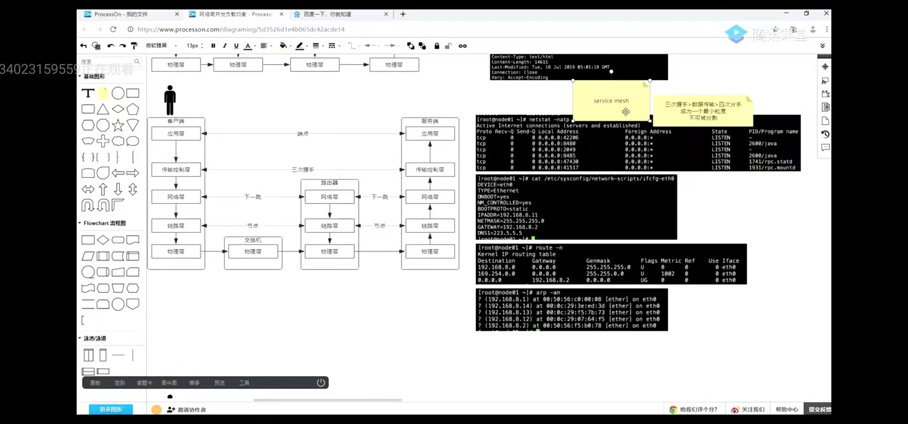

# server端和agent RPC通信

## RPC 原理

RPC，全称 Remote Procedure Call（远程过程调用），即调用远程计算机上的服务，就像调用本地服务一样。以往流行的Web Service就是一种RPC，一般来说RPC 可基于 HTTP 或 TCP 协议，因为Web Service 基于HTTP，所以具有良好的跨平台性，但由于HTTP是应用层协议，相比TCP性能有所损耗。




与本地调用不一样，远程调用需要通过网络层传输，因此涉及到的一个问题就是序列化，不同的序列化方式影响调用性能，流行的序列化包括Protobuf、Kryo、Hessian、Jackson、Thrift。

RPC关键点之一就是传输序列化，简单来说就是客户端调用service时，需要构建一个请求，然后将这个请求序列化传输到服务端，服务端完成调用后，再将结果 序列化后返回


## **RPC和HTTP对比**

### 1.1 **具体实现**

- RPC：可以基于TCP协议，也可以基于HTTP协议。
- HTTP：基于HTTP协议

### 1.2 **效率**

- RPC：自定义具体实现可以减少很多无用的报文内容，使得报文体积更小。
- HTTP：如果是HTTP 1.1 报文中很多内容都是无用的。如果是HTTP2.0以后和RPC相差不大，比RPC少的可能就是一些服务治理等功能。

### 1.3 **连接方式**

- RPC：长连接支持。
- HTTP：每次连接都是3次握手。（断开链接为4次挥手）

### 1.4 **性能**

- RPC可以基于很多序列化方式。如：thrift
- HTTP主要是通过JSON，序列化和反序列效率更低

### 1.5 **注册中心**

- RPC ：一般RPC框架都带有注册中心。
- HTTP：都是直连。

### 1.6 **负载均衡**

- RPC：绝大多数RPC框架都带有负载均衡测量。
- HTTP：一般都需要借助第三方工具。如：nginx


区别主要在这 2 个东西设计的出发点不太一样：

- HTTP 是面向浏览器设计的应用层协议，操作的核心在**资源。**我们更多的用 Web 服务在做网站。
- RPC 是为了在像在本地调用一个函数那样调用远程的代码而设计的，所以更关注减少本地调用和远程调用的差异，像 SOAP(简单对象访问协议) 这种东西是可以把对象当参数传的。

我们讨论 RPC 和 Web 的区别，其实是在谈论 2 个东西：**序列化协议和传输协议**。序列化协议比如常见的 XML，JSON 和比较现代的 Protocol Buffers、Thrift。 传输协议比如 TCP、UDP 以及更高层的 HTTP 1.1、HTTP 2.0。

一般我们考虑用 RPC 而不是 HTTP 构建自己的服务，通常是考虑到下面的因素：

- 接口是否需要 Schema 约束
- 是否需要更高效的传输协议（TCP，HTTP 2.0）
- 是否对数据包的大小非常敏感

比如 HTTP 是基于文本的协议，头部有非常多冗余（对于 RPC 服务而言）。HTTP 中我们用的最多就是 RESTful ，而 RESTful 是个弱 Schema 约束，大家通过文档沟通，但是如果我就是不在实现的时候对接口文档约定的参数做检查，你也不能把我怎么样。这个时候 Thrift 这种序列化协议的优势就体现出来了，由于 Schema 的存在，可以保证服务端接受的参数和 Schema 保持一致。

## 常用RPC框架

Netty - Netty框架不局限于RPC，更多的是作为一种网络协议的实现框架，比如HTTP，由于RPC需要高效的网络通信，就可能选择以Netty作为基础。

brpc是一个基于protobuf接口的RPC框架，在百度内部称为“baidu-rpc”，它囊括了百度内部所有RPC协议，并支持多种第三方协议，从目前的性能测试数据来看，brpc的性能领跑于其他同类RPC产品。

Dubbo是Alibaba开发的一个RPC框架，远程接口基于Java Interface, 依托于Spring框架。

gRPC的Java实现的底层网络库是基于Netty开发而来，其Go实现是基于net库。

Thrift是Apache的一个项目([http://thrift.apache.org](http://thrift.apache.org/))，前身是Facebook开发的一个RPC框架，采用thrift作为IDL (Interface description language)。

jsonrpc


## 启动 server 端

注入`user` `version` 等信息再编译（Windows 下的 git bash 客户端输入命令）

```sh
$ echo 7.0 > VERSION
```

```sh
$ go build -o server.exe  -ldflags "-X 'github.com/prometheus/common/version.BuildUser=root@n9e'  -X 'github.com/prometheus/common/version.BuildDate=`date`' -X 'github.com/prometheus/common/version.Version=`cat VERSION`'" modules/server/server.go
```

```sh
$ ./server.exe --version
```

设置 debug level 打印日志

```sh
$ ./server.exe --log.format=json
```

> MessagePack

- 是一种高效的二进制序列化格式。它允许你在多种语言(如JSON)之间交换数据。但它更快更小。

## 启动 agent 端

```sh
$ go build -o agent.exe  -ldflags "-X 'github.com/prometheus/common/version.BuildUser=root@n9e'  -X 'github.com/prometheus/common/version.BuildDate=`date`' -X 'github.com/prometheus/common/version.Version=`cat VERSION`'" modules/agent/agent.go
```

```sh
$ ./agent.exe --log.format=json
```


