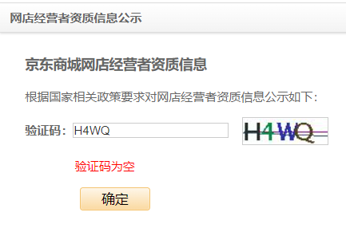

# 抓取 京东商城网店经营者营业执照信息

## 一、环境安装

查看目录下 安装环境.docx

## 二、下载 browsermob-proxy

- 下载browsermob-proxy到本地

  链接：[https://github.com/lightbody/browsermob-proxy/releases/tag/browsermob-proxy-2.1.4](https://links.jianshu.com/go?to=https%3A%2F%2Fgithub.com%2Flightbody%2Fbrowsermob-proxy%2Freleases%2Ftag%2Fbrowsermob-proxy-2.1.4)

- pip install 安装 browsermobproxy 包

## 三、介绍

程序是运行一个GUI界面，然后输入一连串数字范围。然后抓取京东商城网店经营者营业执照信息 https://mall.jd.com/showLicence-11540269.html

之所以用到代理，是因为京东的反爬机制，每次保证抓取是不同的 IP。可以到以下网址申请代理 http://www.xdaili.cn/

## 四、代码走读

程序用到GUI库 tkinter

用到多线程 threading

用到 sqlite 数据库

用到 ddddocr 库识别图像验证码

