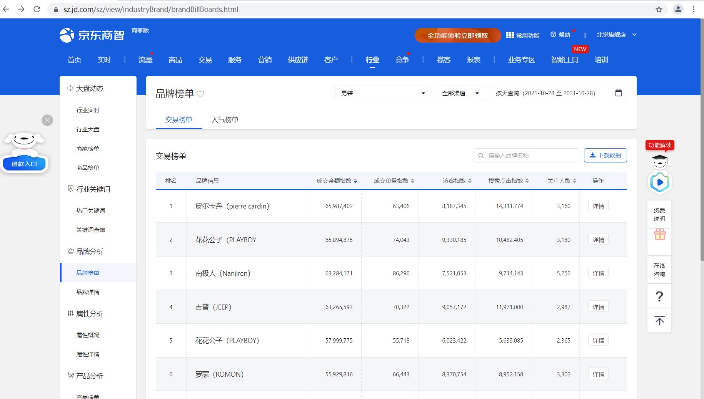

# 京东商智品牌榜单相关信息

## 程序介绍：

- 程序是抓取京东商智品牌榜单相关信息，相当于自动化测试



- 运行程序必须到以下网址 https://registry.npmmirror.com/binary.html?path=chromedriver/ 下载和 google chrome 浏览器版本一致的  chromedriver 放到当前目录下。

- 程序运行在 python 3.7 以上环境，必须安装 selenium 库

```sh
pip install selenium 
```

## 程序代码解读

用到 `configparser` 库读取配置文件

用到 `yield` 关键字生成迭代

用到 `traceback` 库打印异常信息

用到 `os` 库开发日志功能

用到 `csv` 库导出数据到 csv

可以用打包神器 auto-py-to-exe  对项目进行打包，关于  auto-py-to-exe 的介绍：https://mp.weixin.qq.com/s/T41yFepawTJY3YIaNIJKNA